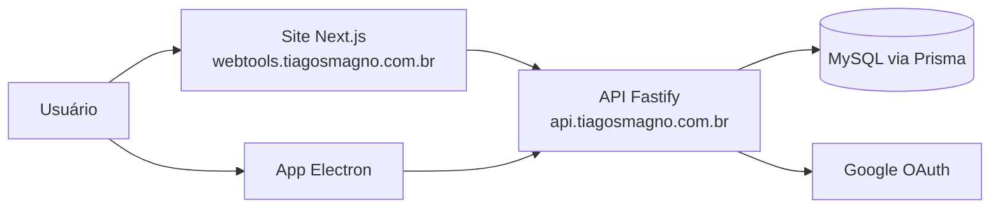

# 🏛️ Arquitetura: Webtools
> Site de ferramentas online (texto, dev, SEO, imagem, PDF, calculadoras) com conta de usuário, API própria e app desktop.

| Versão | Atualizado em | Status | Fase atual |
|---|---|---|---|
| 0.1 | 2026-10-08 | 📝 Rascunho (reconstruído do código) | 6 (Qualidade e entrega) |

Legenda: ✅ confirmado · 💡 hipótese · ❓ em aberto

## 1. Visão geral
Três pacotes independentes no mesmo repositório, cada um com o próprio `package.json` ✅:
- **Raiz**: site Next.js. As ferramentas rodam no navegador (sem enviar dados ao servidor); o servidor só cuida de login e histórico.
- **`server/`**: API Fastify + Prisma + MySQL (auth e histórico de uso por usuário).
- **`electron/`**: app desktop Windows que empacota o export estático do site (`BUILD_TARGET=electron`) e fala com a API.



## 2. Stack
| Camada | Tecnologia | Versão | Propósito | Certeza |
|---|---|---|---|---|
| Frontend | Next.js (App Router) + React | 16.1.6 / 19.2.3 | Site e páginas de ferramenta | ✅ |
| Estilo | Tailwind CSS + variáveis CSS próprias | 4 | Tema claro/escuro via `data-theme` | ✅ |
| Libs de ferramenta | pdf-lib, pdfjs-dist, jszip, mammoth, xlsx, qrcode, jsqr, heic2any, @huggingface/transformers | ver `package.json` | Processamento no navegador | ✅ |
| Backend | Fastify + zod | 5.2 / 3.24 | API REST | ✅ |
| Banco | MySQL + Prisma | Prisma 6.1 | Usuários, tokens, histórico | ✅ |
| Autenticação | JWT (`jose`) + refresh token + bcryptjs + Google OAuth | — | Login obrigatório | ✅ |
| Desktop | Electron + electron-builder (NSIS) | 33 / 25 | App Windows (`br.com.tiagosmagno.webtools`) | ✅ |
| Hospedagem / deploy | Coolify (self-hosted): site em `webtools.tiagosmagno.com.br`, API em `api.tiagosmagno.com.br`; o site ainda puxa do repo do portfolio (troca na tarefa 6.1) | — | Deploy do site e da API | ✅ (informado pelo usuário); servidor e DNS ❓ |

## 3. Estrutura de pastas
```text
src/app/
  tools/<slug>/        # uma pasta por ferramenta: page.tsx (server) + componente "use client"
  components/          # ToolPage (shell), AppShell, MobileLayout, Base64Tool, FormatConverter...
  lib/                 # lógica pura por domínio (text-stats, json-tools, pdf-tools, finance...)
  lib/tools.ts         # REGISTRO ÚNICO de ferramentas (sidebar, home e bottom nav consomem daqui)
  lib/seo.ts           # toolMetadata() e SITE_URL
  lib/auth/            # AuthProvider e ponte com o Electron
  hooks/               # favoritos e recentes
  admin/ conta/ login/ auth/callback/ categoria/[slug]/
server/
  src/{app,db,env,index}.ts   # Fastify
  src/routes/{auth,me,history,admin}.ts
  prisma/schema.prisma + migrations/
  scripts/promote-admin.ts
electron/src/{main,preload}.ts
public/                # inclui pdf.worker.min.mjs
docs/                  # contexto do projeto (este diretório)
project-management/    # LOCAL, fora do git (roadmap e métricas históricos)
```
Regra: não criar pastas novas sem registrar aqui.

## 4. Integrações externas
| Serviço | Para quê | Configuração | Certeza |
|---|---|---|---|
| Google OAuth | Login com Google | `GOOGLE_CLIENT_ID/SECRET/REDIRECT_URI` em `server/.env` | ✅ |
| MySQL | Dados da API | `DATABASE_URL` em `server/.env` | ✅ |
| Coolify | Deploy do site e da API a partir do GitHub | Painel do Coolify (site: Base Directory vazio; API: `/server`) | ✅ |
| Google AdSense | Monetização (roadmap) | ❓ não encontrado no código | ❓ |

Variáveis de ambiente: ver `.env.example` (raiz: `NEXT_PUBLIC_API_URL`) e `server/.env.example`. Nunca versionar valores reais.

## 5. Comandos
- Instalar: `npm install` (raiz) · `npm --prefix server install` · `npm --prefix electron install`
- Rodar site: `npm run dev` (porta 3001 no preview) · API: `npm --prefix server run dev` (porta 3333)
- Build: `npm run build` · Start: `npm start` · Lint: `npm run lint`
- Build do Electron: `npm run build:electron` e, em `electron/`, `npm run dist`
- Banco: `npm --prefix server run db:push` / `db:migrate:deploy` · promover admin: `npm --prefix server run promote-admin`
- Testes: `npm test` (Vitest, só utils puros de `src/app/lib/__tests__/`; config em `vitest.config.mts`)
